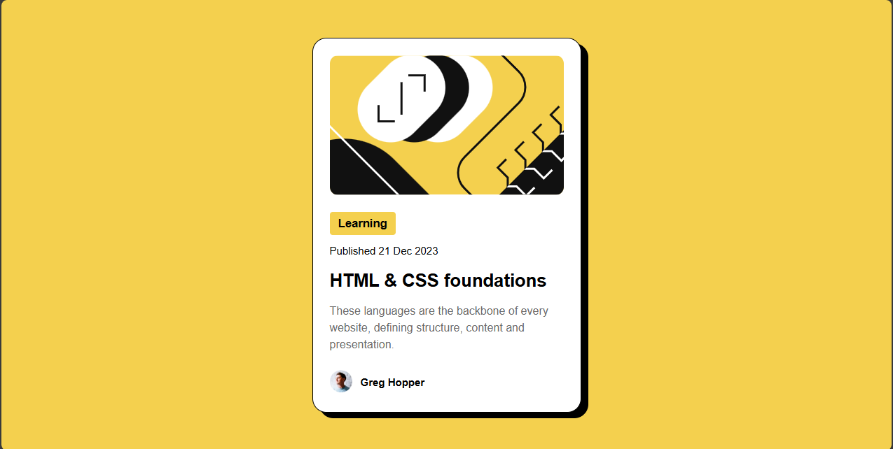

# Frontend Mentor - QR code component solution

This is a solution to the [Blog Preview Card challenge on Frontend Mentor](https://www.frontendmentor.io/challenges/qr-code-component-iux_sIO_H). Frontend Mentor challenges help you improve your coding skills by building realistic projects. 

## Table of contents

- [Overview](#overview)
  - [Screenshot](#screenshot)
  - [Links](#links)
- [My process](#my-process)
  - [Built with](#built-with)
  - [What I learned](#what-i-learned)
- [Author](#author)

## Overview

### Screenshot

### Links

- Solution URL: https://github.com/devmork/Blog-Preview-Card
- Live Site URL: 

## My process

### Built with

- Semantic HTML5 
- CSS Custom Properties
- Flexbox

### What I learned

- What I learned in this project is centering a content or a div on the page and also basic @media query because this project required mobile layout and lastly proper htmls tags but I'm still not confident enough that I'm using it right. 

## Author

- Frontend Mentor - @devmork

